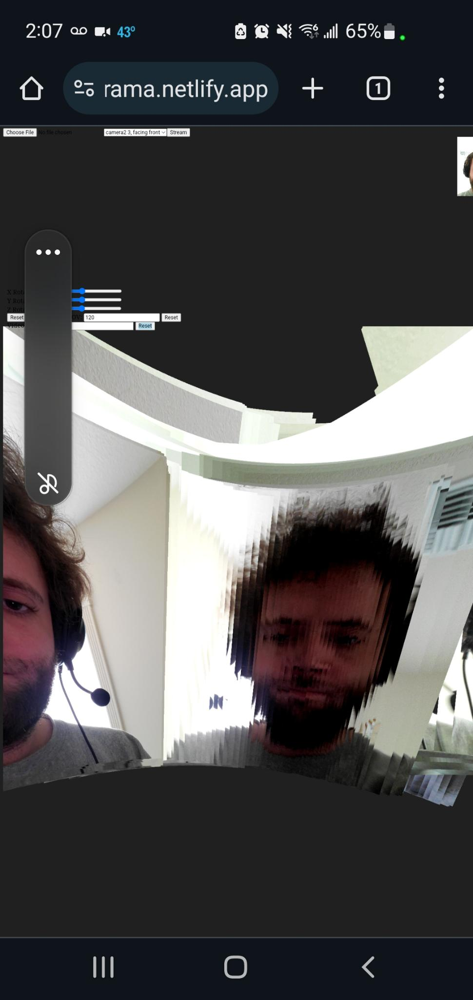
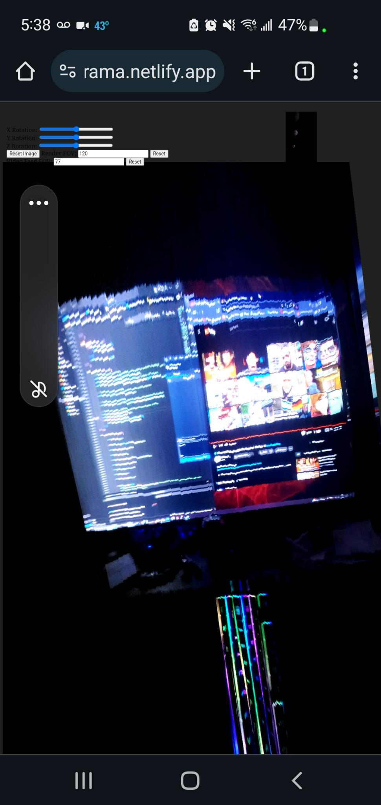

# pano_test
 ThreeJS panoramas example with orientation or gyro. Paint a half sphere with the image!

Demo (android only pretty sure): https://threepanorama.netlify.app/

Make sure you adjust the Video Feed FOV to match your camera's FOV. E.g. my S10e's regular camera is 77 deg, the front facing is ~35 deg (not sure), and the wide field is 123. 

Otherwise still some bugs with CSS and orientation detection on mobile but it kinda works!

